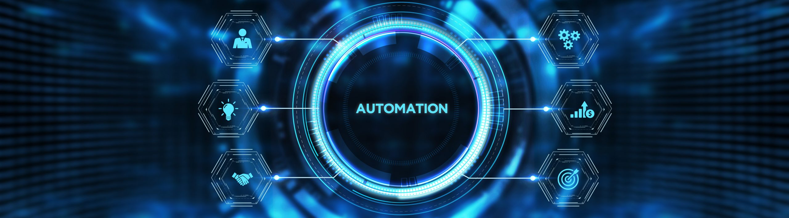

## Overview
This project is a set of side projects which focuse on routine problems in my life. I tried to atoumate them and spend less time on things which are not useful enough for me. Also I appreciate furthur suggestion which you find useful to complete this project: alireza6836812@gmail.com

## Project Structure
at this stage this project has three sections:
### 1) Config_Automation
### 2) Backup_Automation
### 3) Update_Automation
### 4) Behaviour_log_Automation

## Workflow
Each side project has its own workflow. however all of them follow the same logic: 
1- installation and setup necessary files and environments
2- set a time based on your desires to run automaticly the project

## Installation
The base of the projects are in python, furthor languages will be used based on the needs so in this case you have to install neccessary packages and installations. There are no need to other type of installation just make sure you have the mentioned languages on your system:

### 1) Requirenments
1- python
2- jupyter notebook
3- Telegram api ad and api hash
4- internet connection
pyhton packages:
1- pandas
2- numpy

### 2) Setup
the setup depends on each project. in some cases you need to make a ssh connection between your devices to backup, connect to internet for update and config automation and etc, there are also README.md files for each project which discuss this matter in detail.
 
## Usage
the main usage of this project is in our routine life. As a technology addicted person I spend so much time on the internet and work with different stuff, in this way I spend most of my time to do neccessay thing which are the same always. so I decided to automate these workflows and save my time to sleep more.

## Data and configuration
there are several types of data structure types used in the projects:
1- pandas, xlsx and csv files
2- json files

## Status and future improvements
at this point the Config_Automation work correctly, other side projects need to be developed. also for sure I'll add other things to it too in near future.
please inform me with any ideas: alireza6836812@gmail.com
